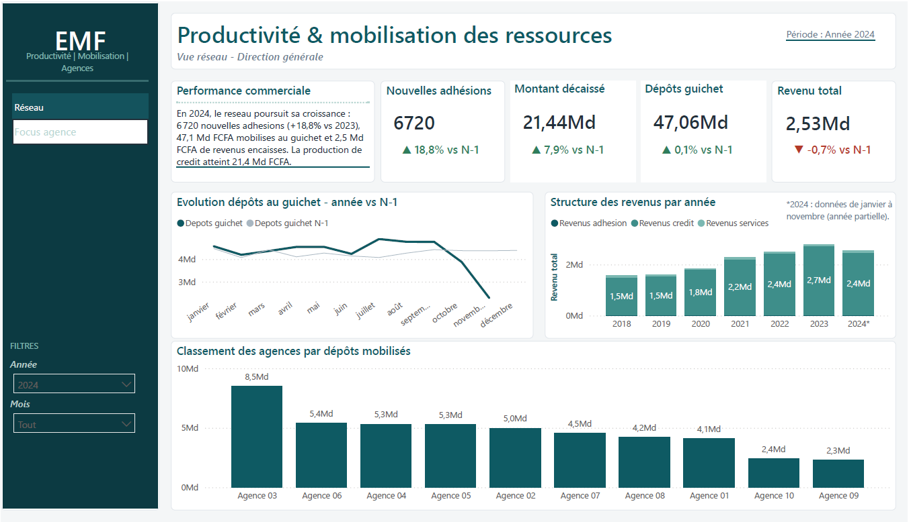
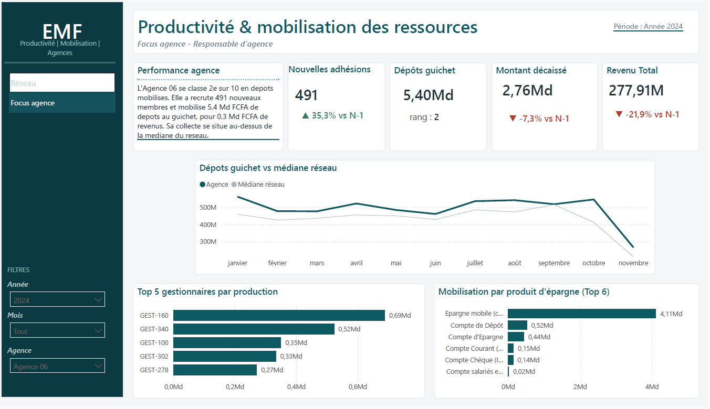

# Productivité & mobilisation des ressources - Établissement de microfinance (EMF)

Dashboard Power BI de pilotage de l'activité commerciale d'un réseau d'agences de microfinance, adossé à un **data mart en étoile** alimenté par **SSIS** depuis une base core banking. Le projet couvre toute la chaîne : de la donnée brute de production jusqu'au tableau de bord de direction, à deux niveaux de lecture (réseau et agence).

> **Message du dashboard :** l'institution est en **croissance offensive** - le recrutement de nouveaux membres s'accélère (+35 % en trois ans), la mobilisation de ressources et les revenus encaissés progressent, et la performance se répartit inégalement entre agences. C'est le **pendant « développement »** d'un premier dashboard consacré, lui, à la qualité du portefeuille de crédit.

> **Portfolio en deux volets :** ce projet est le pendant offensif d'un premier dashboard consacré au risque. Voir aussi ➡️ **[Analyse de la qualité d'un portefeuille de crédit](https://github.com/Super-237/dashboard-qualite-portefeuille-credit)** - même institution, angle défensif (encours, PAR, recouvrement).

**🔗 [Explorer le dashboard interactif en ligne](https://app.powerbi.com/view?r=eyJrIjoiZmZiODRlNDYtMTUyNi00YjBmLThjNDYtZjgzYTRhOTdmMmI3IiwidCI6ImZlMTdmMGZmLTM2OTUtNGEwOS1hMzc2LWZmZTc3NWU4YzAyNiJ9&pageName=2646e2bd91ef0316a0ae)** - filtrez par année, mois et agence · 📄 [version PDF](docs/dashboard_productivite.pdf) pour la consultation hors-ligne.




---

## Contexte

Les données proviennent du système **core banking de production** d'un **établissement de microfinance (EMF)** d'Afrique centrale (zone CEMAC), un réseau d'une dizaine d'agences. L'objectif : transformer cette base opérationnelle, non pensée pour l'analyse, en un outil de pilotage de la performance commerciale, lisible aussi bien par une direction générale que par un responsable d'agence.

> **Confidentialité :** projet personnel à visée pédagogique. Les données sont **anonymisées** - institution désignée « EMF », agences renommées en libellés neutres (« Agence 01 »…), gestionnaires remplacés par des codes neutres (« GEST-XXX »), aucun nom de client, de localité ni de compte exposé. Seuls des **agrégats mensuels** sont présentés. Aucune donnée personnelle n'est diffusée.

## Questions métier traitées

- La coopérative recrute-t-elle davantage de membres, et à quel rythme (acquisition) ?
- Mobilise-t-elle plus de ressources au guichet, et via quels produits d'épargne ?
- Quels revenus l'activité génère-t-elle (intérêts encaissés, commissions, frais) ?
- Quelles agences et quels gestionnaires portent la performance, et comment se situent-ils par rapport au réseau ?

## Architecture

```
CoreBanking_EMF (SQL Server 2019, core banking, prod)
        │   extraction + anonymisation + agrégation mensuelle
        ▼
   SSIS (packages .dtsx, idempotents)
        │   chargement en étoile
        ▼
PRODUCTIVITE_DM (data mart, schéma en étoile)
        │   import
        ▼
   Power BI (modèle + DAX + thème)  ──►  Dashboard 2 pages
```

**Stack :** SQL Server 2019 · SSIS (Visual Studio) · Power BI Desktop · T-SQL · DAX

## Modèle de données (schéma en étoile)

Quatre tables de faits au **grain mensuel (flux)**, pilotées par des dimensions conformes :

- **`FACT_ADHESION`** - nouvelles adhésions (mois × agence × gestionnaire).
- **`FACT_EPARGNE`** - flux de dépôts et retraits au guichet (mois × agence × produit d'épargne).
- **`FACT_PRODUCTION_CREDIT`** - production de crédit : prêts décaissés (mois × agence × gestionnaire × produit).
- **`FACT_REVENU`** - revenus encaissés par type (mois × agence × type de revenu).
- **Dimensions** : `DIM_CALENDRIER`, `DIM_AGENCE` (anonymisée), `DIM_GESTIONNAIRE` (anonymisée), `DIM_PRODUIT` (dimension conforme étendue crédit + épargne), `DIM_TYPE_REVENU`.

## Choix méthodologiques

- **Fenêtre 2018 → novembre 2024**, grain mensuel : la borne basse correspond à la migration du core banking (fin 2017) ; décembre 2024, incomplet, est exclu. Une fenêtre unique pour tous les faits garantit la cohérence de lecture.
- **Revenus en optique encaissement (cash)** plutôt que produits courus : on mesure ce qui est réellement entré en caisse sur la période. Ces revenus ont été **réconciliés avec la comptabilité générale** (classe 7) pour valider l'exhaustivité du périmètre.
- **Périmètre guichet** : les ressources issues de la collecte journalière de terrain sont consolidées dans les dépôts guichet et donc bien mesurées ; le détail par collecteur relève d'un module distinct, hors périmètre de ce dashboard.
- **TVA exclue des revenus** : collectée pour le compte de l'État, elle ne constitue pas une production de l'institution.
- **Étanchéité avec le dashboard crédit** : la production de crédit est traitée ici comme un **acte commercial** (nombre et montant décaissés), sans aucune notion de qualité (PAR, retard, recouvrement), qui relève de l'autre projet.
- **Benchmarking sans cible** : faute d'objectifs dans le système source, chaque agence est située par rapport au réseau - contribution, rang, et écart à la **médiane** (repère robuste). Une comparaison honnête, sans donnée inventée.
- **Comparaisons annuelles en cumul janvier→novembre** pour comparer équitablement une année en cours (partielle) à la précédente.

## Principaux constats

| Indicateur | 2021 | 2022 | 2023 |
|---|---|---|---|
| Nouvelles adhésions | 4 523 | 5 101 | 6 122 |
| Dépôts mobilisés au guichet (Md FCFA) | ~42 | ~47 | ~51 |
| Production de crédit décaissée (Md FCFA) | ~18 | ~20 | ~22 |
| Revenus encaissés (Md FCFA) | ~2,3 | ~2,5 | ~2,8 |

➡️ **Dynamique de croissance nette et généralisée**, portée par un recrutement en hausse et une mobilisation d'épargne soutenue (le canal de collecte de proximité en est le principal moteur). La performance reste **inégale entre agences**, ce que la page « Focus agence » permet de diagnostiquer par le rang et l'écart à la médiane.

## Limites & périmètre

Par souci de transparence analytique :

- **Une seule institution, un seul contexte** (microfinance CEMAC) : les constats ne sont pas généralisables tels quels à d'autres réseaux.
- **Année 2024 partielle** (janvier→novembre) : signalée explicitement sur les visuels concernés ; les comparaisons annuelles sont bornées en cumul à novembre pour rester équitables.
- **Revenus en optique encaissement**, pas comptable : ils reflètent les entrées de caisse réelles, avec un décalage temporel normal par rapport aux produits courus de la comptabilité. Un contrôle de réconciliation avec la comptabilité générale a validé l'exhaustivité du périmètre.
- **Absence d'objectifs** dans le système source : la performance est située en **relatif** (rang, écart à la médiane du réseau), pas par rapport à une cible.
- **Détail de la collecte de terrain hors périmètre** : ses fonds sont mesurés (consolidés dans les dépôts), mais l'analyse par collecteur relèverait d'un dashboard dédié.

## Structure du dépôt

```
dashboard-productivite-mobilisation/
├── sql/
│   ├── 01_create_productivite_dm.sql     # DDL du data mart (étoile)
│   ├── 02_sources_dimensions.sql         # requêtes source des dimensions (anonymisées)
│   ├── 03_sources_faits.sql              # requêtes source des faits
│   ├── 04_reset_data_mart.sql            # reset (idempotence)
│   └── 05_reconciliation_hdpm.sql        # contrôle qualité revenus vs comptabilité
├── powerbi/
│   ├── mesures_dax.dax                   # mesures DAX documentées
│   └── theme_productivite.json           # thème Power BI (Pétrole & terracotta)
├── docs/                                 # guides de construction, captures d'écran, PDF
└── README.md
```

*Les packages SSIS (`.dtsx`) ne sont pas versionnés : ils contiennent la chaîne de connexion réelle. Seuls les scripts SQL et les guides sont publiés.*

## Reproduire

1. Restaurer une base source sur SQL Server, exécuter `sql/01_create_productivite_dm.sql`.
2. Monter le projet SSIS en suivant `docs/guide_ssis.md`, exécuter les packages (dimensions puis faits).
3. Ouvrir le rapport Power BI, actualiser, appliquer `powerbi/theme_productivite.json`.
4. (Optionnel) Exécuter `sql/05_reconciliation_hdpm.sql` pour le contrôle qualité des revenus.

## Compétences démontrées

- Modélisation dimensionnelle (constellation multi-faits, dimensions conformes de Kimball)
- ETL avec SSIS (data flows, lookups de clés de substitution, anonymisation, idempotence)
- T-SQL avancé (CTE, fonctions de fenêtrage, unification de sources hétérogènes, contrôle de réconciliation comptable)
- DAX (contexte de filtre, time intelligence, benchmarking par rang et médiane, synthèses narratives dynamiques)
- Conception de dashboard (storytelling à deux audiences, hiérarchie visuelle, discipline des couleurs, accessibilité)
- Rigueur analytique (validation des hypothèses sur les données, gestion des limites de complétude, honnêteté sur les périodes partielles)

---

*Projet réalisé par Arnold - professionnel de la data (10 ans d'expérience IT, dont 5 ans comme DBA et analyste Power BI).*

📫 *Contact / LinkedIn : [(https://www.linkedin.com/in/arnoldsandjou/)]· Autres projets : [profil GitHub](https://github.com/Super-237/dashboard-qualite-portefeuille-credit)*
